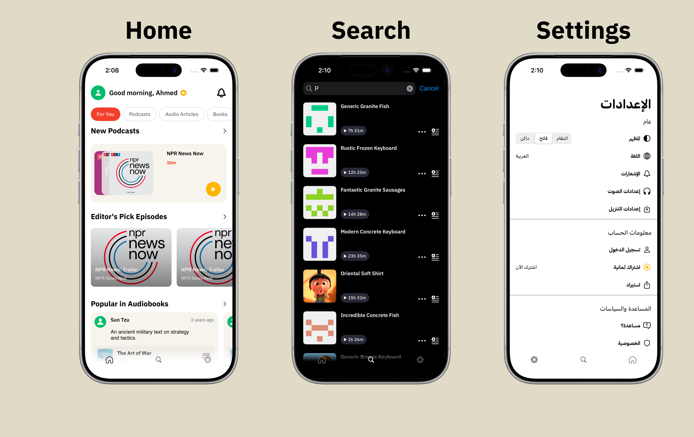
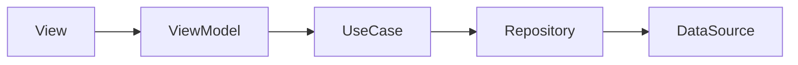

# Take Home Project | Podcast App

### Screen Shots



---

### Table of Contents

- [Description](#description)
- [Architecture](#architecture)
- [Frameworks](#frameworks)
- [Getting Started](#getting-started)
- [Author Info](#author-info)

---

## Description

- A podcast app bringing diverse audio content (podcasts, audiobooks, episodes, articles) into a single experience
- **Home** — Sections with infinite scroll, content filters (podcasts, audiobooks, episodes, articles), multiple layout types
- **Search** — Debounced search (200ms) with live API integration
- **Settings** — Language (Arabic/English), dark mode, accessibility (VoiceOver, Dynamic Type)
- Built as an iOS take-home assessment using Clean Architecture and MVVM

---

## Architecture

The app follows **Clean Architecture** with **MVVM** in the presentation layer. Dependencies flow inward — no singletons, constructor injection throughout.



**Data flow:** View → ViewModel → UseCase → Repository → DataSource

- **Two-level DI container** — AppDIContainer + feature containers (HomeDIContainer, SearchDIContainer, SettingsDIContainer) via EnvironmentKey

**Layers:**
- **Presentation** — SwiftUI/UIKit views + ViewModels
- **Domain** — Use cases, entities
- **Data** — Repositories, DTOs, remote data sources
- **Infrastructure** — Networking, extensions

---

## Frameworks

- SwiftUI
- UIKit (UITabBarController, Settings UICollectionView)
- Swift Concurrency (async/await)
- Kingfisher (image caching)
- MVVM + Clean Architecture
- Swift Package Manager

---

## Getting Started

### Requirements

- Xcode 15+
- iOS 17+
- Swift 5.9+

### Tests

```bash
xcodebuild test -scheme "Take Home Project" -destination 'platform=iOS Simulator,name=iPhone 16'
```

---

## Author Info

- Twitter — [@othmansh0](https://twitter.com/othmansh0)
- LinkedIn — [Othman Shahrouri](https://linkedin.com/in/othmansh0)

[Back To The Top](#take-home-project--podcast-app)
